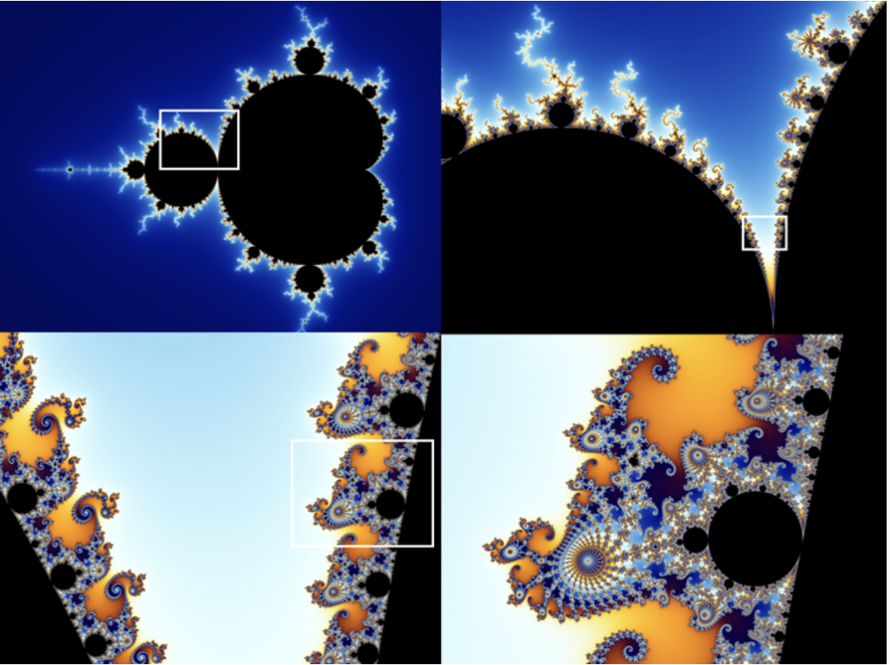

# fractals

 Fractals are a class of infinitely complex geometrical patterns which are self-similar across multiple different scales and exist within a "fractal dimension". Their *self-similarity* allows similar patterns to appear at different levels. This can be observed in successive magnifications of the Mandelbrot set below.

Natural fractals are used to describe many spatially nonuniform phenomena in nature such as coastlines, mountain ranges and plants. Furthremore, their application in the real-world (i.e. the fractal antenna) has proven to be very efficient in the technological domain.

Abstract fractals are visual representations of the behaviour of numbers when put through recursive functions.

This repository contains notes on the following fractals:
- 